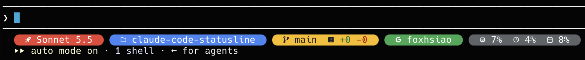

# claude-code-statusline

Claude Code 的 powerline 膠囊風格狀態列（Google 四色）。

顯示：帳號 ｜ 火箭 logo + 目前模型（如 `Sonnet 5.5`）｜ 資料夾 ｜ git 分支與增刪行數（有 PR、CI、部署時一併顯示）｜ 用量（context %、5h %、7d %，5h／7d 旁附距離重設的倒數，如 `2h10m`）

有兩種版本：

- **mod（建議）**：`mods/statusline-capsule/`，膠囊畫在提示框上方。
- **shell script**：`statusline.sh`，走 `settings.json` 的 `statusLine`，畫在提示框下方。



上圖是乾淨、與遠端同步的 `main` 分支、寬度足夠時的畫面，五個膠囊由左到右依序是：帳號、模型、資料夾（名稱過長時以 `…` 截斷）、git（分支與增刪行數）、用量（context、5h、7d；5h 與 7d 後面是距離重設的倒數）。

分支有未推送的 commit、是沒推送過的新分支，或有 PR、部署設定時，黃色 git 膠囊後面會多出內容，見下方「git 膠囊：↑↓、PR、CI、部署」一節。終端機變窄或開啟側欄時會自動隱藏部分膠囊，見[窄終端機與長名稱](#窄終端機與長名稱)。

## 需求

- [Nerd Font](https://www.nerdfonts.com/)（兩種版本都需要）
- `git`
- [`gh`](https://cli.github.com/)（選用，已登入；沒有的話 git 膠囊不顯示 PR 與 CI）
- shell script 版另外需要 `jq`、`bash`

## 安裝 Nerd Font

圖示依賴 Nerd Font，沒裝的話會顯示成方框或亂碼。

**macOS（Homebrew）**

```sh
brew install --cask font-jetbrains-mono-nerd-font
```

其他字型可用 `brew search nerd-font` 查詢，例如 `font-meslo-lg-nerd-font`、`font-fira-code-nerd-font`。

**Linux**

```sh
mkdir -p ~/.local/share/fonts
curl -fLo /tmp/JetBrainsMono.zip https://github.com/ryanoasis/nerd-fonts/releases/latest/download/JetBrainsMono.zip
unzip -o /tmp/JetBrainsMono.zip -d ~/.local/share/fonts
fc-cache -fv
```

**Windows**

到 [Nerd Fonts 下載頁](https://www.nerdfonts.com/font-downloads) 下載字型，解壓後選取 `.ttf` 檔，按右鍵選「為所有使用者安裝」。

**安裝後：把終端機字型換成 Nerd Font**

安裝字型不會自動生效，要在終端機設定裡選用它（字型名稱結尾通常是 `Nerd Font` 或 `NF`）：

- Terminal.app：設定 → 描述檔 → 文字 → 字體
- iTerm2：Settings → Profiles → Text → Font
- VS Code 內建終端機：設定 `terminal.integrated.fontFamily`，例如 `"JetBrainsMono Nerd Font"`
- Warp：Settings → Appearance → Text → Terminal font

## 安裝 mod 版（statusline-capsule）

`mods/statusline-capsule/` 是 Claude Code mod：膠囊畫在提示框上方，資料來自 `$.session`，不需要 `jq` 或 `settings.json` 的 `statusLine`。

```
/plugin install statusline-capsule --marketplace foxhsiao/claude-code-statusline
```

輸入後依序按 `y` 加入 marketplace、選 scope（選 user 就會套用到所有 session）。

從本機資料夾安裝：

```
/plugin install statusline-capsule --marketplace /path/to/claude-code-statusline
```

只想在單一 session 試用：`claude --plugin-dir mods/statusline-capsule`。改完程式後在 session 內執行 `/reload-plugins`。

改用 mod 後，可以把 `settings.json` 裡原本的 `statusLine` 區塊移除，避免兩條同時出現。

更新：改程式後要把 `mods/statusline-capsule/.claude-plugin/plugin.json` 的 `version` 加一，否則已安裝的人 `claude plugin update` 會判斷沒有新版。

### git 膠囊：↑↓、PR、CI、部署

黃色 git 膠囊在分支與增刪行數後面，視情況多顯示這些內容：

| 顯示 | 意思 |
| --- | --- |
| `↑2`、`↓1` | 領先、落後 upstream 的 commit 數 |
| `↑新` | 這個分支還沒推送過（沒有 upstream，且不是預設分支） |
| `#12` | 開著的 PR；草稿為 `#12 草稿`；`#12 已合併`（綠）、`#12 已關閉`（紅） |
| 圈圈打勾（綠）、圈圈打叉（紅）、循環箭頭（黃） | PR 的 CI 檢查全部通過、有失敗、執行中，緊接在 `#N` 後面；沒有 CI 時不顯示。這是 Nerd Font 圖示（U+F058、U+F057、U+F021），不是文字 |
| `已進 main` | 沒有 PR，但這個分支的 commit 已經在預設分支裡 |
| 火箭圖示：綠、紅、黃加 `?` | 正式站版本與預設分支相同（綠）、落後（紅）、讀不到或認不出（黃，火箭後面多一個 `?`）。火箭是 Nerd Font 圖示（U+F135），不是文字 |

「有東西才顯示」：沒有 PR、沒設定部署時，只剩分支、增刪行數與 ↑↓；PR、CI、部署前面有一條 `│` 分隔。

PR 與 CI 來自 `gh pr view`，需要已登入的 [`gh`](https://cli.github.com/)；沒有 `gh` 時這兩項不顯示，其餘照常。

**比對正式站版本（選用）**：在 repo 根目錄放 `.ship-band.json`：

```json
{ "deploy": { "url": "https://example.com/version.json" } }
```

膠囊會抓這個網址，從內容取第一個像 commit 的字串（7 到 40 個十六進位字元），與 `origin/<預設分支>` 比對，所以正式站要公開自己的 commit。可選欄位：`"header": "x-commit"` 改讀該回應標頭，`"pattern": "sha=([0-9a-f]+)"` 自己指定要取的字串（有群組時取第一組）。沒有這個檔案就不顯示部署。

這些要上網的讀取（`git fetch`、`gh`、部署網址）最多每分鐘一次，另外在回合結束，以及執行 `gh pr`、`git push`、`wrangler`、`deploy` 等指令後觸發，不會卡住工具呼叫。不在 git repo 內時整段不顯示。

#### 從 ship-band 遷移

原本獨立的 `ship-band` 外掛已併入 statusline-capsule 並從 marketplace 移除。已安裝的人：

```
claude plugin uninstall ship-band
claude plugin update statusline-capsule
```

- `.ship-band.json` 沿用，不用改。
- 提示框上方不再有獨立的 `發佈` 那一行；PR、CI、部署改顯示在黃色 git 膠囊裡。
- 原本的分支名與「工作區 ✓ 乾淨」不再另外顯示：分支在 git 膠囊，有未提交變更時看 `+n -n`。
- 兩個都留著的話，舊的 `發佈` 行還會出現，內容與膠囊重複。

### 重設倒數

5h、7d 的百分比後面接距離視窗重設的剩餘時間，顯示成灰色小字：

| 剩餘 | 顯示 |
| --- | --- |
| 2 小時 10 分 | `2h10m` |
| 45 分 | `45m` |
| 3 天 4 小時 | `3d4h` |

- 每分鐘重畫一次，閒置時倒數也會往下走；分鐘數無條件進位，最後一分鐘顯示 `1m`。
- 沒有重設時間（例如非訂閱帳號）或已過期時不顯示倒數，只剩百分比。
- context 沒有重設概念，不附倒數。

### 窄終端機與長名稱

膠囊寬度依提示框上方可用的欄數（`bodyColumns`）計算，中日韓字元算 2 格。空間不夠時，整個膠囊依序隱藏：

1. 帳號
2. 資料夾
3. git 膠囊裡的 PR、CI、部署
4. 整個 git 膠囊（分支與增刪行數）

模型與用量永遠保留。隱藏是整個膠囊一起拿掉，不會把單一膠囊截短。

5h／7d 用量旁的重設倒數也算在用量膠囊的寬度裡，所以窄終端機會比沒有倒數時更早開始隱藏其他膠囊。

資料夾與分支名超過上限時，保留開頭並以 `…` 結尾（結尾的內容會被截掉）：

| 常數 | 預設 | 說明 |
| --- | --- | --- |
| `MAX_DIR` | 20 | 資料夾名稱最多顯示格數 |
| `MAX_BRANCH` | 24 | 分支名稱最多顯示格數 |

實際畫面：Claude Code 視窗左邊開著側欄（spaces／agents），內容區只剩約 66 欄時，提示框上方只剩 `Sonnet 5.5` 與用量（context、5h、7d）兩個膠囊，單行顯示、不折行，右側的 `[-]` 也保留。關掉側欄、內容區變寬後，隱藏的膠囊會回來。資料夾名稱過長時則在寬度足夠的情況下以 `…` 結尾，例如 `claude-code-statusl…`。

截斷發生在寬度判斷之前，所以隱藏順序用的是截斷後的實際寬度。常數在 `mods/statusline-capsule/hooks/register.tsx`。

版本異動見 [CHANGELOG.md](CHANGELOG.md)。

## 安裝 shell script 版

```sh
cp statusline.sh ~/.claude/statusline.sh
chmod +x ~/.claude/statusline.sh
```

再把 `settings.snippet.json` 的 `statusLine` 區塊合併進 `~/.claude/settings.json`。

## 自訂

**mod 版**：圖示、配色在 `mods/statusline-capsule/hooks/register.tsx` 上方的常數區，名稱長度上限 `MAX_DIR`／`MAX_BRANCH` 也在這個檔案；模型顯示名稱由 `modelName()` 從 model ID 轉出。

**shell script 版**：

- 圖示與配色在 `statusline.sh` 上方的 ICON / 配色區。
- `statusline-icons.sh` 可在終端機預覽候選圖示。
- `CC_STYLE` 可選 `solid` / `outline` / `hollow`。
- `CLAUDE_STATUSLINE_DEBUG=1` 會把 stdin JSON 存到 `/tmp/claude-statusline-debug.json`。

## 開發：推送前檢查

`scripts/check.sh` 一次跑三項檢查，`scripts/hooks/pre-push` 讓它在每次 `git push` 前自動執行，任何一項失敗就擋下 push：

1. `claude plugin validate`：確認外掛載得起來。驗證不過時整個 mod 不會載入，statusline 會直接消失（0.5.0 就發生過）。
2. `claude plugin test`：跑 mod 底下所有 `*.test.ts`。
3. 型別檢查（`tsc`）：mod 本來就有幾個既有錯誤，記在 `scripts/tsc-baseline.txt`，只有**新增**的錯誤才會失敗。修掉其中一個後，把那一行從 baseline 刪掉。

**啟用 hook**（每個 clone 各做一次，這是本機 git 設定，不會被 commit）：

```sh
git config core.hooksPath scripts/hooks
```

**安裝 `tsc`**：型別檢查用 TypeScript 編譯器，已列在 `package.json` 的 `devDependencies`，在 repo 根目錄執行一次就好，不用再設 `TSC`：

```sh
npm install
```

腳本會自動找 `node_modules/.bin/tsc`。想改用別的編譯器時，才用環境變數 `TSC=/path/to/tsc` 指定（優先於 `node_modules`；兩者都沒有時才會用 PATH 上的 `tsc`）。還沒執行過 `npm install` 時，型別檢查會印出提示並略過，其他兩項照跑；設 `CHECK_STRICT=1` 則缺工具也算失敗。`node_modules/` 已被 `.gitignore` 排除。

型別檢查還需要 `mods/statusline-capsule/.claude-plugin/types/`。這個資料夾由 Claude Code 產生、被 git 忽略，全新 clone 沒有它，用 `claude --plugin-dir mods/statusline-capsule` 開一次就會出現；沒有的話型別檢查同樣會略過。

注意：檢查的是**工作區**，不是要推送的那個 commit，工作區有未 commit 的變動時會警告。確定要略過時用 `git push --no-verify`。也可以隨時手動跑 `scripts/check.sh`。

## 授權

[MIT License](LICENSE)
